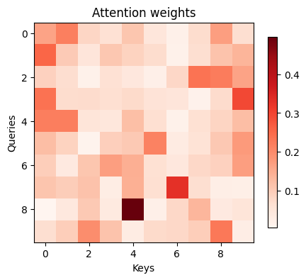

# 第四个例子

画histogram

这里我们稍微写了一下attention中scale dot-product操作的例子，可以划出最后的softmax之前的注意力和softmax之后的注意力，对比可以看出softmax的作用就是将小的值推到0，大的值推到了1。

其中我们画出经典的注意力图看一下

| softmax之前的注意力图 | softmax之后的注意力图 |
| --------------------- | --------------------- |
|  |  |